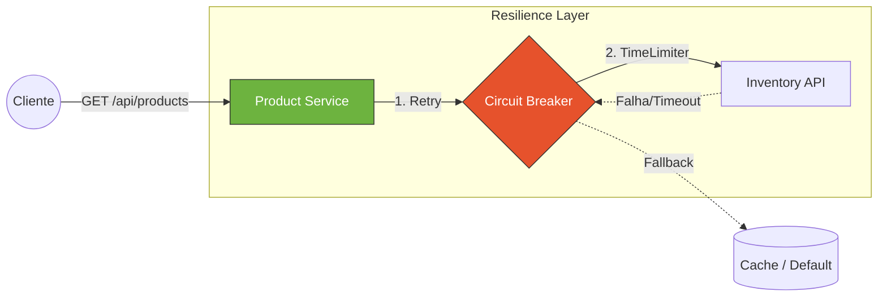

# APIs Resilientes com Spring Boot & Resilience4j


Este repositório contém a implementação prática dos padrões de tolerância a falhas discutidos no artigo **"APIs resilientes com Retry, Timeout e Circuit Breaker usando Resilience4j"**.

O objetivo é demonstrar como blindar microsserviços contra falhas de rede, latência e indisponibilidade de dependências externas.

## 🏗️ Arquitetura de Resiliência

O projeto simula um serviço de produtos (`Product API`) que depende de um serviço de inventário instável. O Resilience4j atua como um proxy de proteção entre eles.



### Mecanismos Aplicados

- **Retry**: Tenta reenviar a requisição 3 vezes com Backoff Exponencial em caso de falhas de I/O.
- **Circuit Breaker**: Monitora a taxa de falhas. Se > 50%, "abre o circuito" e bloqueia novas chamadas imediatamente.
- **TimeLimiter**: Cancela threads que demoram mais que 2 segundos (SLA).
- **Fallback**: Retorna uma resposta degradada (ex: "Estoque Indisponível") em vez de um erro 500.

## 📂 Estrutura do Projeto

```
/
├── docker-compose.yml           # Infraestrutura (Prometheus, WireMock Opcional)
├── pom.xml                      # Dependências (incluindo AOP e Actuator)
└── src/
    ├── main/java/.../
    │   ├── config/              # Configuração do RestTemplate
    │   ├── service/             # Lógica de Negócio
    │   │   ├── InventoryClient.java      # [Síncrono] @Retry + @CircuitBreaker
    │   │   └── AsyncInventoryService.java # [Assíncrono] @TimeLimiter + CompletableFuture
    │   └── controller/          # Endpoints para teste
    │
    └── test/java/.../
        └── ResilienceIntegrationTest.java # Testes de Caos com WireMock
```

## 🔍 Destaques de Código

| Recurso | Arquivo / Local | Descrição |
|---------|-----------------|-----------|
| Configuração Central | `application.yml` | Definição de thresholds, janelas deslizantes e exceções |
| Anotações | `InventoryClient.java` | Uso de `@CircuitBreaker` + `@Retry` com fallback tipado |
| Timeout Assíncrono | `AsyncInventoryService.java` | `CompletableFuture` com `@TimeLimiter` |
| Teste de Caos | `ResilienceIntegrationTest.java` | Falhas HTTP simuladas com WireMock |

## 🚀 Como Rodar Localmente

### Pré-requisitos

- Java 17+
- Maven
- Docker (opcional para métricas)

### Passo 1: Subir Infraestrutura de Observabilidade

```bash
docker-compose up -d
```

Isso iniciará o Prometheus na porta 9090.

### Passo 2: Rodar a Aplicação

```bash
mvn spring-boot:run
```

### Passo 3: Testar Cenários de Falha

A aplicação tenta conectar em `http://localhost:9099` (não existe), simulando erro real.

| Cenário | Comando | Resultado |
|---------|---------|-----------|
| Retry + Fallback | `curl http://localhost:8080/api/products/1/sync` | 3 tentativas + fallback amigável |
| Circuit Breaker | `for i in {1..10}; do curl http://localhost:8080/api/products/1/sync; done` | Após 5 erros, chamadas falham instantaneamente |

## 📊 Observabilidade

Com a aplicação rodando e falhando:

- **URL**: http://localhost:9090
- **Query**: `resilience4j_circuitbreaker_state`

**Estados**:
- `0` = CLOSED
- `1` = OPEN
- `2` = HALF_OPEN

## 🛠️ Stack Tecnológica

- Spring Boot 3.5.4
- Resilience4j
- Micrometer + Prometheus
- WireMock
- Lombok